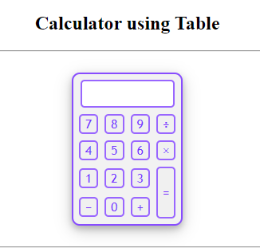

# Calculator Project

## Overview
This is a simple calculator project built using HTML, CSS, and JavaScript. It employs a table layout for a structured and user-friendly interface.

## Preview

## Features
- Basic arithmetic operations (addition, subtraction, multiplication, division)
- Table layout for organized display
- Clear and concise JavaScript code for functionality

## Usage
1. Clone the repository to your local machine.
2. Open `index.html` in your preferred web browser.
3. Start performing calculations!

Feel free to explore the code and make any enhancements or modifications as needed.

## Folder Structure
- `styles`: Contains the styles for the calculator.
- `script`: Holds the JavaScript code for calculator functionality.
- `index.html`: The main HTML file.

## Credits
- Abdullah Ansari

Happy coding!
